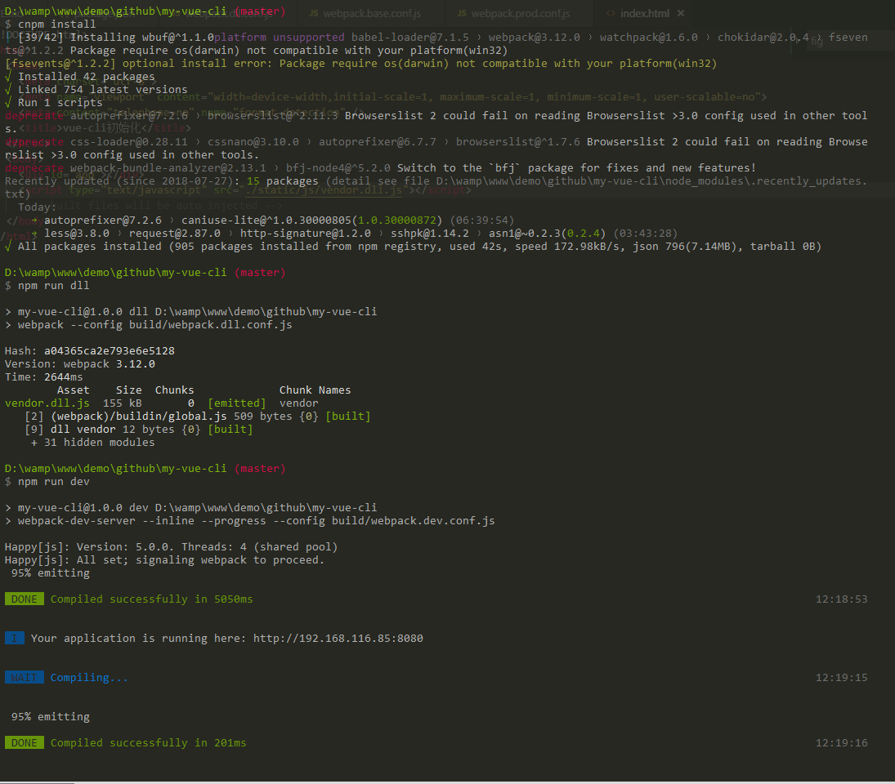

# vue-cli之webpack3构建全面提速优化


## 效果图




## 1、启用happypack多核构建项目

安装happypack后，修改/build/webpack.base.conf.js文件即可
<br/>
<br/>

```code
npm install happypack --save

// build/webpack.base.conf.js

const HappyPack  = require('happypack');
const os = require('os');
const happThreadPool = HappyPack.ThreadPool({size: os.cpus().length});
var webpack = require('webpack')
// 增加HappyPack插件
plugins: [
    new HappyPack({
        id: 'js',
        loaders: ['babel-loader?cacheDirectory=true'],
        threadPool: happThreadPool
    }),
  ]
// 修改引入loader
{
    test: /\.vue$/,
    loader: 'vue-loader',
    options: {
        loaders: {
        js: 'happypack/loader?id=js' // 将loader换成happypack
        }
    }
},
{
    test: /\.js$/,
    loader: ['happypack/loader?id=js'], // 将loader换成happypack
    include: [resolve('src')], // src是项目开发的目录
    exclude: [path.resolve('../../node_modules')] // 不需要编译node_modules下的js 
},

```

<br/>
<br/>

## 2、启用DllPlugin和DllReferencePlugin提取第三库

增加build/webpack.dll.conf.js文件，并在其中配置需要单独DLL化的模块
<br/>
<br/>

```code

const path = require('path');
const webpack = require('webpack');

module.exports = {
  entry: {
    vendor: ['vue/dist/vue.esm.js', 'vue-router', 'axios',] // 需要打包起来的依赖
  },
  output: {
    path: path.join(__dirname, '../static/js'), // 输出的路径
    filename: '[name].dll.js', // 输出的文件，将会根据entry命名为vendor.dll.js
    library: '[name]_library' // 暴露出的全局变量名
  },
  plugins: [
    new webpack.DllPlugin({
      path: path.join(__dirname, '.', '[name]-mainfest.json'), // 描述依赖对应关系的json文件
      name: '[name]_library', 
      context: __dirname // 执行的上下文环境，对之后DllReferencePlugin有用
    }),
    new webpack.optimize.UglifyJsPlugin({ // uglifjs压缩
      compress: {
        warnings: false
      }
    })
  ]
}

```

在build/webpack.base.conf.js 增加如下插件

<br/>
<br/>

```code

new webpack.DllReferencePlugin({
    context: __dirname,
    manifest: require('./vendor-manifest.json')
})
```
<br/>
<br/>

在/package.json里script增加命令
<br/>
<br/>

```code
"dll": "webpack --config build/webpack.dll.conf.js"
```

<br/>
<br/>

## 3、chunkhash持久化缓存，避免未修改的文件重新添加hash

在build/webpack.prod.conf.js 增加如下插件
<br/>
<br/>

```code

new webpack.HashedModuleIdsPlugin(),

```

<br/>
<br/>

## 4、开发步骤

``` bash
# 安装依赖的库
npm install

# 使用dllplugin预编译与引用，提取第三方库
npm run dll

# 开发环境
npm run dev

# 生产环境
npm run build

```


